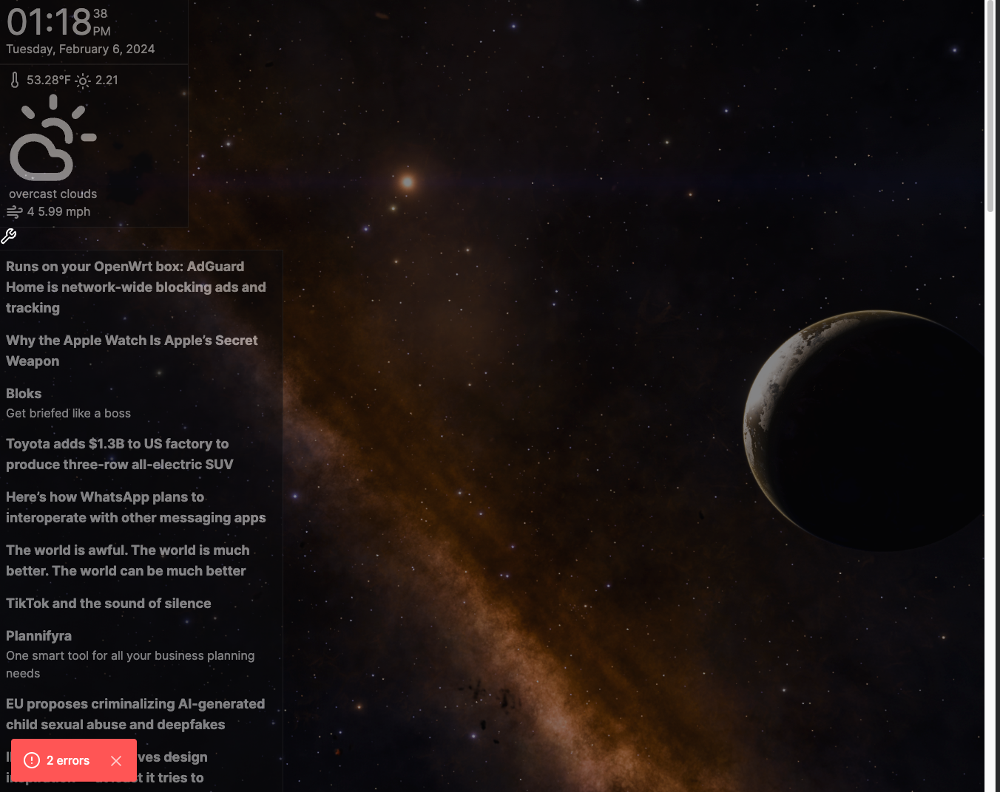

This is a [Next.js](https://nextjs.org/) project bootstrapped with [`create-next-app`](https://github.com/vercel/next.js/tree/canary/packages/create-next-app).

## Overview

Dissatisfied with Dakboard's limited interactivity and feature set, I created this project
to provide a highly customizable and interactive platform to create POC dashboards for all my projects. 
It includes interactive widgets, seamless Notion integration for real-time data display, and extensive customization options to fit my needs.

- MVP Goal is to create a basic Dakboard replacement dashboard
- Once done, i will focus on expanding this to encompass dashboards/uis for my personal hacking projects
  - Utilize a consistent widget, provider pattern for my personal coding ecosystem
  - LLM Chatbot Interface connected to personal project 'the corpus'
    - MVP RAG chatbot utilizing Notion DB
    - OTher Datasources to include data around transcoding/etl pipelines
  - Home Assistant Integrations (low low priority when i decide i need HA)


TODO: re-integrate innercircle-divergent branch
  - [ ] grid control layers dashboard contexts etc
  - need to be reconnected to the widget HOC wrapper etc
  - github actions workflow

## Status

None of these components are fully implemented yet but the POCs are working more or less

- [75%] Time Widget
- [70%] Weather Widget
  - Uses open weather API
  - Radial weather clock
- [50%] News Widget
  - Utilizes Panda RSS feeds
  - style and marguee mode
- [ ] Agenda Widget (calendar)
  - connected to google calendar
- [ ] Todo Widget
  - connected to notion databases
- [ ] Meal Prep widget
  - connected to notion database
- Notes Widget
- [75%!!!] create automatic preview generation (pupetteer hanging)
  - gulp task that runs the server and screenshots the page
- [ ] LLM Chat Widget

- [ ] Final Styling
  - synthwave it up???
- [ ] fix all typescript errors (constant)
- [75%] Integrate react grid on widgets
  - [100%] allow for drag and drop of widgets
  - [80%]allow resizing of widgets
    - [ ] Responsive typography ui component
  - [100%] load and save widget layout on change
  - export widget layout to file???
  - handle proper overflow scrolling for widgets
    - autoscroll marquee ability on the scroll area component
- [33%] integrate wiget configuration mode
  - [ ] allow saving and loading widget configuration to local storage
  - currently using levo but tempted to move back to flippable cards...
- [] switch from static backgrounds to dropbox background source

## Preview

> Currently in version 0.0.1



## Getting Started

First, run the development server:

```bash
yarn dev
```
