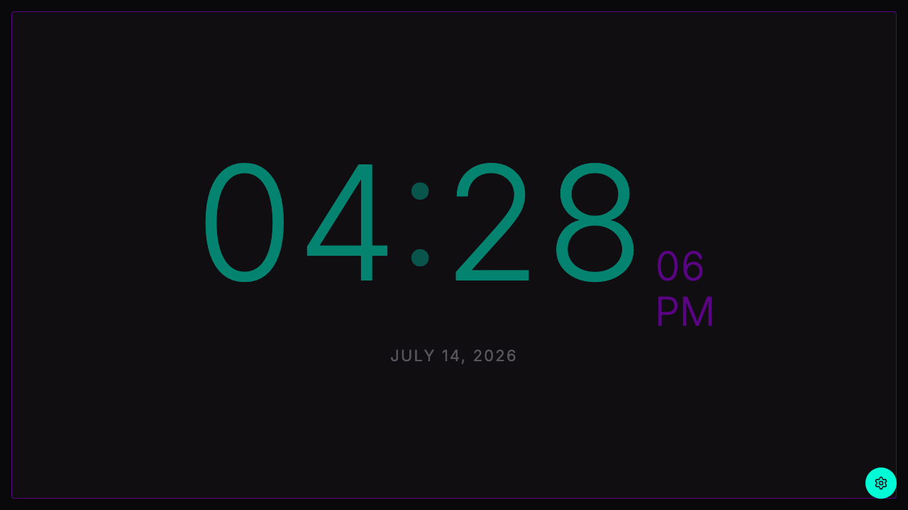
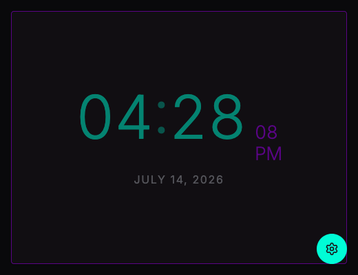
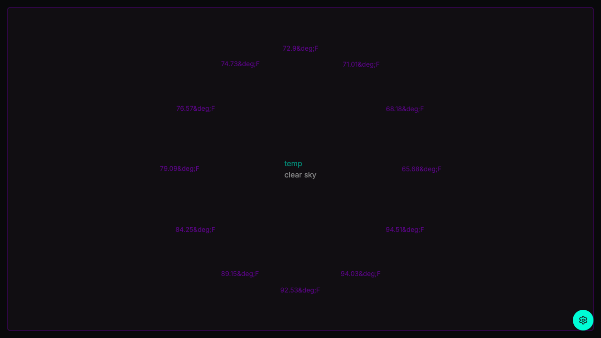
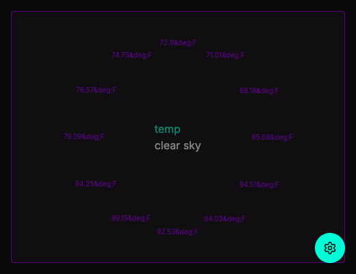
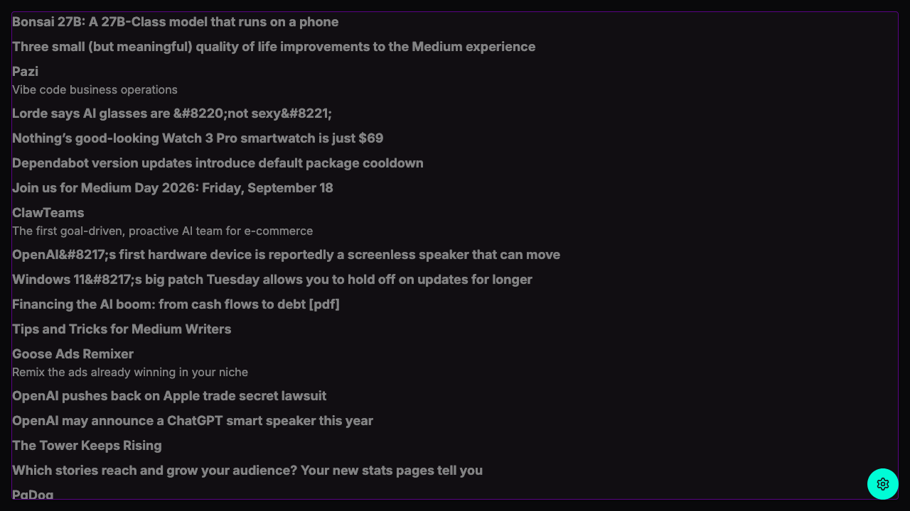
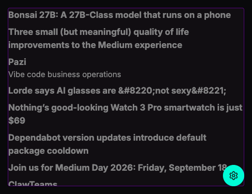
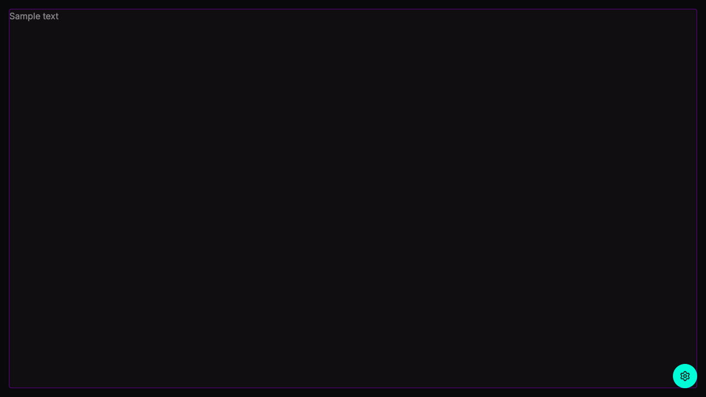
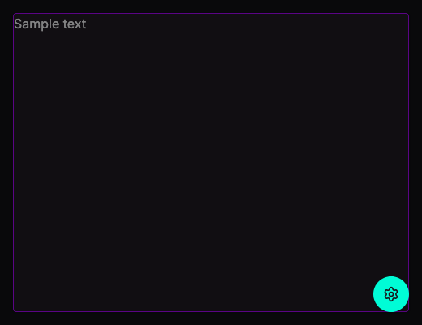

# Widget Gallery

> Auto-generated by `tests/e2e/docs.spec.ts` — regenerated on every `yarn test:e2e`.
> Screenshots are captured in isolation via `?widget=<key>`.

| widget | controls |
|---|---|
| `time` | `24-hour`, `Show seconds`, `Show date`, `Date format` |
| `weather` | `City`, `Metric rotation (seconds)` |
| `news` | `Article limit` |
| `text` | `Content` |

## Time

Fluid pixel sizing scales with container width.

**wide** — 1280×720

**narrow** — 520×400

## Weather

Requires `VITE_OPEN_WEATHER_API_KEY` in `.env`. Renders 12-hour clock face with weather condition icons around the perimeter.

**wide** — 1280×720

**narrow** — 520×400

## News

Fetches RSS-aggregated headlines from the Panda API.

**wide** — 1280×720

**narrow** — 520×400

## Text

Minimal placeholder for arbitrary text.

**wide** — 1280×720

**narrow** — 520×400

